# Ansible playbook: labocbz.deploy_grafana_and_prometheus


## Description


Welcome to the summary of the Ansible playbook for simplifying the deployment and configuration of Prometheus, Grafana, and Apache2. This playbook offers great flexibility, allowing you to install these essential monitoring and visualization components either on a single machine or on multiple machines.

The playbook is divided into three main tasks, each managed by a dedicated role:

1. **Grafana Installation**: The first step involves installing Grafana, a powerful tool for creating dashboards and visualizing data. Grafana is often used for monitoring metrics collected by Prometheus. The installation can be configured for a single machine or multiple machines, depending on your requirements.
2. **Prometheus Installation**: The second step is the installation of Prometheus, an open-source monitoring and alerting system. It is frequently used for collecting and storing metrics from various sources. The playbook provides the ability to configure multiple jobs for Prometheus and is idempotent, meaning you can run it multiple times to update your configurations.
3. **Apache2 Installation with Grafana Configuration**: A significant portion of this playbook is dedicated to installing Apache2, a popular web server, along with a specific configuration for Grafana. This is recommended when exposing Grafana over the Internet. Using Apache2 as a reverse proxy in front of Grafana enhances security and performance.

To facilitate customization and adaptation to your specific requirements, the playbook uses boolean variables. You can set these variables in configuration files or directly in host and playbook variables. For example, you can set `inv_install_apache: true` to indicate your desire to install Apache2.

A common use case for this playbook is deploying a Prometheus cluster with federation capabilities, enabling data collection from multiple sources. Whether you need to install these components on a single machine or a group of machines, this Ansible playbook offers a flexible solution to meet your needs.

## Deployment diagramm



Here is a possible deployment example using this playbook. We can install the "Prometheus and Grafana" service on two main subsystems: Prometheus and Grafana.
* The Prometheus subsystem is an abstraction of a Prometheus cluster based on federation functionality. A Prometheus server can scrape data from other servers, consolidating all the data into a single endpoint. In our example, one server federates data from two other servers, which, in turn, collect metric data from additional servers.
* The Grafana subsystem consists of an Apache2 server as a reverse proxy and the Grafana server. In our example, Apache2 is installed on the same server as Grafana to add an extra layer of security to the service (QoS, WAF, LDAP Auth, SSL/TLS, mTLS, etc.).

All communications are encrypted and sometimes authenticated through client certificates and passwords (mTLS and Basic Auth for Prometheus).

## Tests and simulations

### Basics

You have to run multiples tests. *tests with an # are mandatory*

```MARKDOWN
# lint
# syntax
# converge
# idempotence
# verify
side_effect
```

Executing theses test in this order is called a "scenario" and Molecule can handle them.

Molecule use Ansible and pre configured playbook to create containers, prepare them, converge (run the playbook) and verify its execution.
You can manage multiples scenario with multiples tests in order to get a 100% code coverage.

This playbook contains a ./tests folder. In this folder you can use the inventory or the tower folder to create a simualtion of a real inventory and a real AWX / Tower job execution.

### Command reminder

```SHELL
# Check your YAML syntax
yamllint -c ./.yamllint .

# Check your Ansible syntax and code security
ansible-lint --config=./.ansible-lint .

# Execute and test your playbook
molecule lint
molecule create
molecule list
molecule converge
molecule verify
molecule destroy

# Execute all previous task in one single command
molecule test
```

## Installation

To install this playbook, just copy/import this playbook or raw file into your fresh playbook repository or call it with the "include_playbook/import_playbook" module.

## Usage

### Vars

```YAML
# From inventory
---
all vars from to put/from your inventory
```

```YAML
# From AWX / Tower
---
# all vars from to put/from your inventory
# see tests/inventory/group_var for all groups and vars.
```

## Architectural Decisions Records

Here you can put your change to keep a trace of your work and decisions.

### 2023-10-14: First Init

* First init of this playbook with the bootstrap_playbook playbook by Lord Robin Crombez

### 2023-10-14-b: Full Deploy

* Playbook deploy Prometheus
* Playbook deploy Grafana
* Playbook deploy Apache2 as front reverse proxy
* mTLS from Prometheus => Prometheus
* mTLS From Graf => Prometheus
* TLS from apache2 => Graf
* TLS from Client => apache2
* Why use Apache2 ? Because you can set secutiry with WAF, LDAP Auth, etc. as primary Auth gate
* Groups are required for vars, but deployment is done with boolean vars, you can deploy Prometheus cluster only, or just Grafana, or just Apache2, or both, etc. Just use boolean vars as inv_install_apache to deploy Apache2 on the host you wanted, in test case: molecule-1

### 2023-12-16: System users

* Role can now use system users and address groups
* Updated with 10 years cert

## Authors

* Lord Robin Crombez

## Sources

* [Ansible playbook documentation](https://docs.ansible.com/ansible/latest/playbook_guide/playbooks_reuse_playbooks.html)
* [Ansible Molecule documentation](https://molecule.readthedocs.io/)
* [labocbz.prepare_host](https://github.com/CBZ-D-velop/Ansible-Role-Labocbz-Prepare-Host.git)
* [labocbz.add_certificates](https://github.com/CBZ-D-velop/Ansible-Role-Labocbz-Add-Certificates.git)
* [labocbz.install_grafana](https://github.com/CBZ-D-velop/Ansible-Role-Labocbz-Install-Grafana.git)
* [labocbz.install_prometheus](https://github.com/CBZ-D-velop/Ansible-Role-Labocbz-Install-Prometheus.git)
* [labocbz.install_apaches](https://github.com/CBZ-D-velop/Ansible-Role-Labocbz-Install-Apache.git)
* [labocbz.add_apache_confs](https://github.com/CBZ-D-velop/Ansible-Role-Labocbz-Add-Apache-Confs.git)
